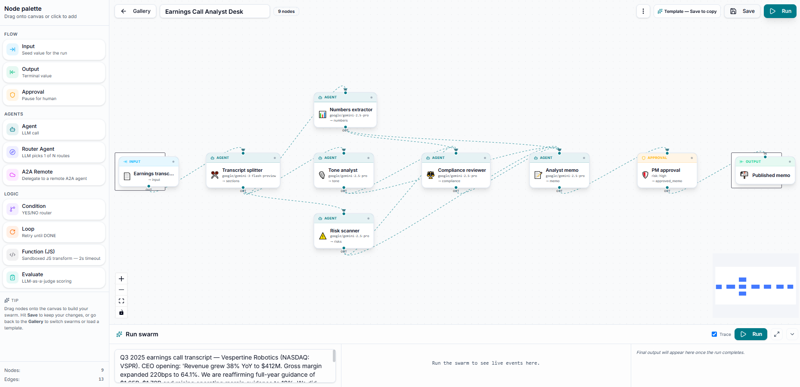
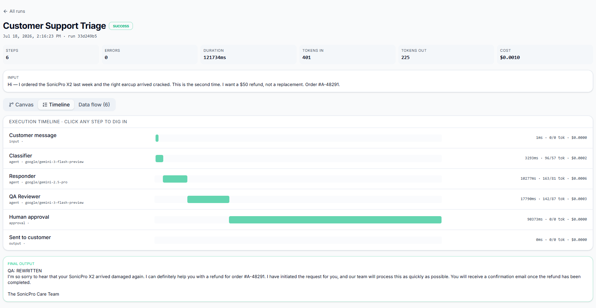

  

<h1 align="center">
  
  AgentSwarms
</h1>

  <b>Visualizing, Orchestrating, and Scaling Multi-Agent AI Workflows</b>
   
  The interactive sandbox and learning platform for next-generation AI agent swarms.

  
  
  

  <a href="https://agentswarms.fyi"><b>Website</b></a> ·
  <a href="https://github.com/AgentSwarms-fyi/AgentSwarms.fyi"><b>Core Repository</b></a> ·
  <a href="https://github.com/orgs/AgentSwarms-fyi/repositories"><b>All Repositories</b></a>

 

## 🚀 About AgentSwarms

AgentSwarms is an open-source ecosystem dedicated to making multi-agent systems **accessible, transparent, and developer-friendly**. Building complex AI workflows shouldn't require guessing how models hand off tasks, consume tokens, or fail under pressure.

Our flagship platform, **[agentswarms.fyi](https://agentswarms.fyi)**, gives you a visual canvas and a robust runtime to prototype, trace, and deploy cooperating AI agents — with absolute clarity into every step, token, and dollar spent.

 

## ✨ What You Can Build

- 🧩 **Visual swarm canvas** — drag agents, routers, approvals, conditions, loops, and JS functions onto a graph and wire them together
- 🤖 **Composable agent nodes** — LLM agents, router agents that pick 1-of-N paths, and A2A nodes that delegate to remote agents
- 🧑‍⚖️ **Human-in-the-loop approvals** — pause any run for sign-off before it continues
- 🔍 **Full execution tracing** — step-by-step timelines with duration, tokens in/out, and cost for every node
- 🔀 **Multi-provider support** — bring your own models across providers
- ⚡ **Save, run, iterate** — turn any swarm into a reusable template and re-run it in seconds

 

## 🖼️ See It In Action

<table>
<tr>
<td width="50%">
  
  
Build swarms visually on the canvas

</td>
<td width="50%">
  
  
Trace every run — steps, tokens, and cost

</td>
</tr>
</table>

 

## 📦 Featured Repository

| Repository                                                                | Description                                                                               |
| ------------------------------------------------------------------------- | ----------------------------------------------------------------------------------------- |
| [**AgentSwarms.fyi**](https://github.com/AgentSwarms-fyi/AgentSwarms.fyi) | The core visual canvas & runtime for building, running, and tracing multi-agent AI swarms |

Browse everything we're building → **[github.com/AgentSwarms-fyi](https://github.com/AgentSwarms-fyi)**

 

## 🤝 Contributing

We welcome contributions of all kinds — bug reports, feature ideas, docs, and pull requests. Head over to the [AgentSwarms.fyi repository](https://github.com/AgentSwarms-fyi/AgentSwarms.fyi), open an issue, or start a discussion. Every swarm starts with one node.

 

  <a href="https://agentswarms.fyi">🌐 Website</a> &nbsp;·&nbsp;
  <a href="https://github.com/AgentSwarms-fyi">💻 GitHub</a>

Built with ❤️ by the AgentSwarms team

